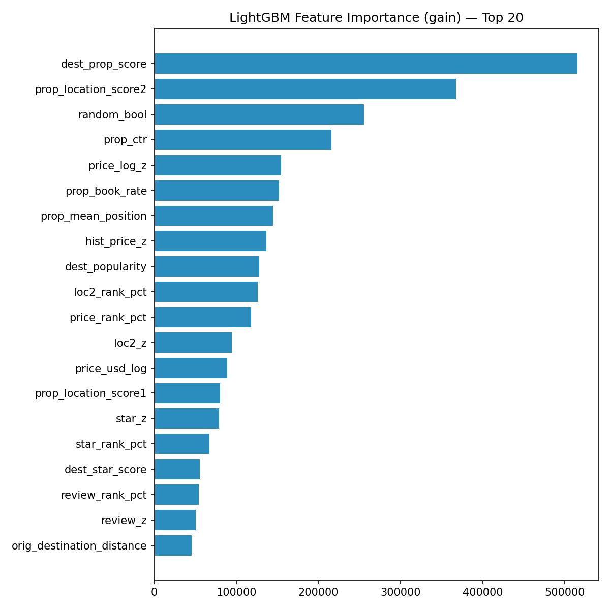

# Hotel Search Learning to Rank

An academic group case study in ranking hotel search results with popularity features and
LightGBM LambdaMART. It was created for the 2026 Data Mining Techniques course at Vrije
Universiteit Amsterdam, not as a production Expedia system.

> **Ownership note:** this was a three-person coursework project. Nicholas Boidi implemented
> the data pipeline, feature engineering, model training, validation split, fairness analysis,
> and ranking-file generation. Pablos Tselioudis Garmendia led the report structure, related
> work, result interpretation, and scalable-deployment discussion. **Filippo Donghi helped
> with exploratory analysis, reviewed plots and metrics, and contributed to final report
> editing and presentation.** This repository is retained as a team project and does not
> present the implementation as Filippo's sole work.

## What the group explored

The assignment used roughly five million labeled hotel impressions and five million test
impressions. The group:

- constructed graded relevance labels for bookings and clicks;
- compared a smoothed popularity baseline with LambdaMART;
- engineered query-relative price, quality, competitor, history, and destination features;
- split whole searches between training and validation;
- measured NDCG@5; and
- performed an exploratory family/non-family subgroup analysis.

Historical local validation results preserved from the submitted coursework are:

| Model | NDCG@5 |
| --- | ---: |
| Smoothed popularity baseline | 0.2417 |
| LightGBM LambdaMART | 0.3895 |
| Exploratory family-weighted LambdaMART | 0.3894 |

These are local coursework measurements from [the stored metrics](outputs/metrics.json), not
an independently reproduced leaderboard score. CI deliberately does not download or process
the restricted competition data.

## Run the synthetic demo

The bundled demo exercises input schema handling, query-level splitting, feature engineering,
smoothed popularity features, and NDCG without Kaggle data, LightGBM, or OpenMP.

Prerequisite: Python 3.12 or newer.

    python3 -m venv .venv
    source .venv/bin/activate
    python -m pip install -r requirements.txt
    python -m data_mining_techniques demo

Windows PowerShell activation:

    .venv\Scripts\Activate.ps1

To save the result:

    python -m data_mining_techniques demo --output artifacts/demo.json

The synthetic metric is only a smoke test and is not comparable with the historical result.

## Full historical pipeline

The full pipeline is available for reviewers who already have authorized access to the
course's in-class Kaggle files. The data is not redistributed here, and the assignment
explicitly prohibited substituting the original public Expedia competition data.

Install the optional modeling dependencies:

    python -m pip install -r requirements-full.txt

LightGBM needs an OpenMP runtime. On macOS with Homebrew:

    brew install libomp

Run with explicit input and output paths:

    python -m data_mining_techniques train \
      --train-data /path/to/training_set_VU_DM.csv \
      --test-data /path/to/test_set_VU_DM.csv \
      --output-dir artifacts

The command validates both CSV schemas before training and emits concise errors for missing
files, columns, or optional native dependencies. Generated submissions and full-data artifacts
are ignored by Git. Expect a resource-intensive run: the historical workflow materializes
several copies of multi-million-row frames and uses all available CPU cores for LightGBM.

Review the command contract with:

    python -m data_mining_techniques --help
    python -m data_mining_techniques train --help

## Project layout

| Path | Purpose |
| --- | --- |
| **data_mining_techniques/core.py** | Import-safe feature engineering, schema checks, query split, and NDCG |
| **data_mining_techniques/demo.py** | Deterministic synthetic dataset and smoke workflow |
| **data_mining_techniques/pipeline.py** | Historical LightGBM training, plotting, fairness comparison, and submissions |
| **data_mining_techniques/cli.py** | CLI and actionable error handling |
| **tests/** | Unit, integration, schema, CLI, and submission-contract tests |
| **outputs/** | Small figures and metrics retained from the historical group run |
| **main.tex** | Redacted source of the scientific report |
| **process_report.tex** | Redacted source documenting the submitted division of work |

The official LNCS template files are not redistributed. Building the historical report source
requires obtaining a compatible **llncs.cls** directly from Springer.

## Tests and code quality

    python -m pip install -r requirements-dev.txt
    ruff check .
    ruff format --check .
    pytest

GitHub Actions runs those checks plus the synthetic demo on pushes and pull requests. It does
not claim that the private-data, full LightGBM experiment is reproduced in CI.

## Methodology limitations

This refresh makes the original approach inspectable; it does not rewrite history or silently
claim that the coursework methodology has been repaired.

- **Target encoding:** the historical model applies popularity maps to some of the same
  training rows used to build them. A stronger experiment would use out-of-fold encodings.
- **Validation:** the preserved split is random by search ID rather than temporal, so it
  cannot estimate future-data drift.
- **Fairness:** family queries scored better before weighting. The weight of 1.6 was an
  exploratory coursework choice, was not selected on a separate tuning split, and has no
  confidence intervals or causal interpretation. A smaller metric gap is not proof of fairness.
- **Metric convention:** the historical NDCG implementation skips searches whose ideal DCG is
  zero. The core function exposes this choice explicitly so it can be tested.
- **Submission contract:** the refactored writer uses the **SearchId,PropertyId** names shown
  in the assignment brief. Anyone rerunning the private competition should still verify the
  exact sample-submission contract supplied by the course.
- **Reproducibility:** stored plots and metrics are historical artifacts. Reproducing them
  requires authorized data and substantially more memory/time than the synthetic CI path.

## Data, privacy, and licensing

- Raw Expedia/Kaggle data, generated ranking submissions, the VU assignment brief, compiled
  reports containing student identifiers, and bundled Springer templates are intentionally
  excluded.
- Student numbers were removed from the retained report sources.
- The removed submissions, PDFs, templates, and student identifiers still exist
  in earlier Git history. Removing them permanently requires a coordinated history rewrite.
- The remaining aggregate plots and metrics are included only as evidence of the group
  coursework result; they do not expose raw customer records.
- No open-source license is asserted. The work has multiple contributors and relies on data
  governed by competition terms, so reuse permission should not be assumed.

## Original contributor roles

| Contributor | Role recorded in the submitted process report |
| --- | --- |
| Nicholas Boidi | Implemented the data pipeline, feature engineering, LightGBM model training, validation split, fairness analysis, and local ranking-file generation |
| Pablos Tselioudis Garmendia | Led report structure, related work, result interpretation, and scalable-deployment discussion |
| Filippo Donghi | Helped with exploratory analysis, reviewed plots and metrics, and contributed to final editing and presentation |
